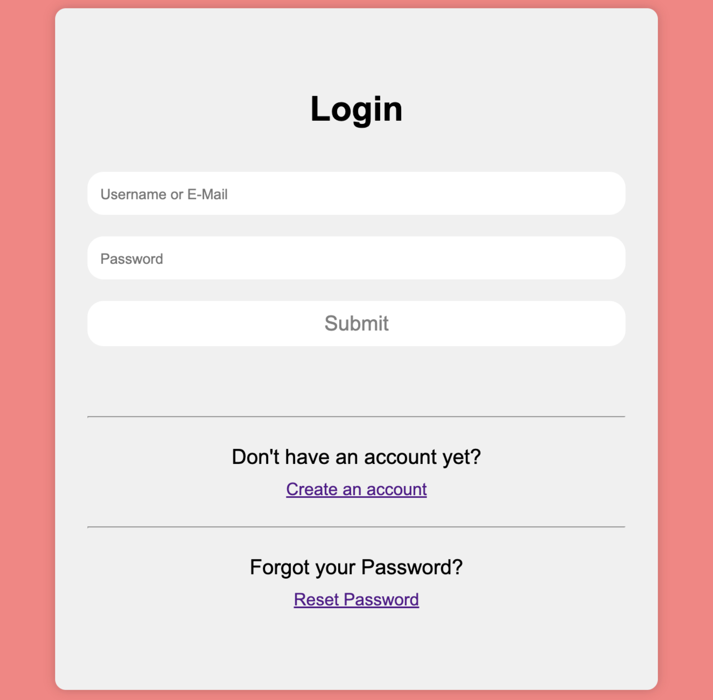
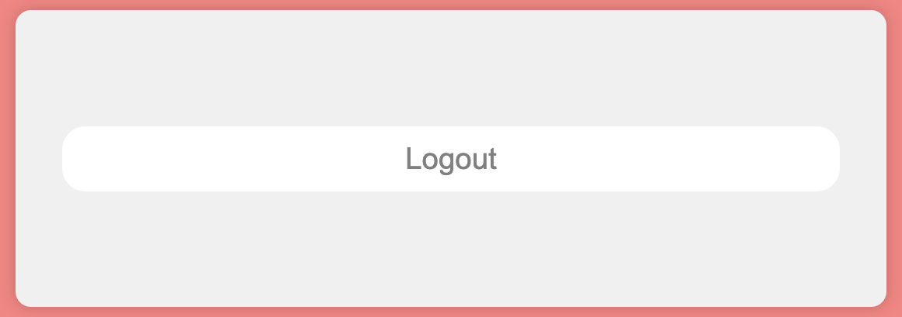
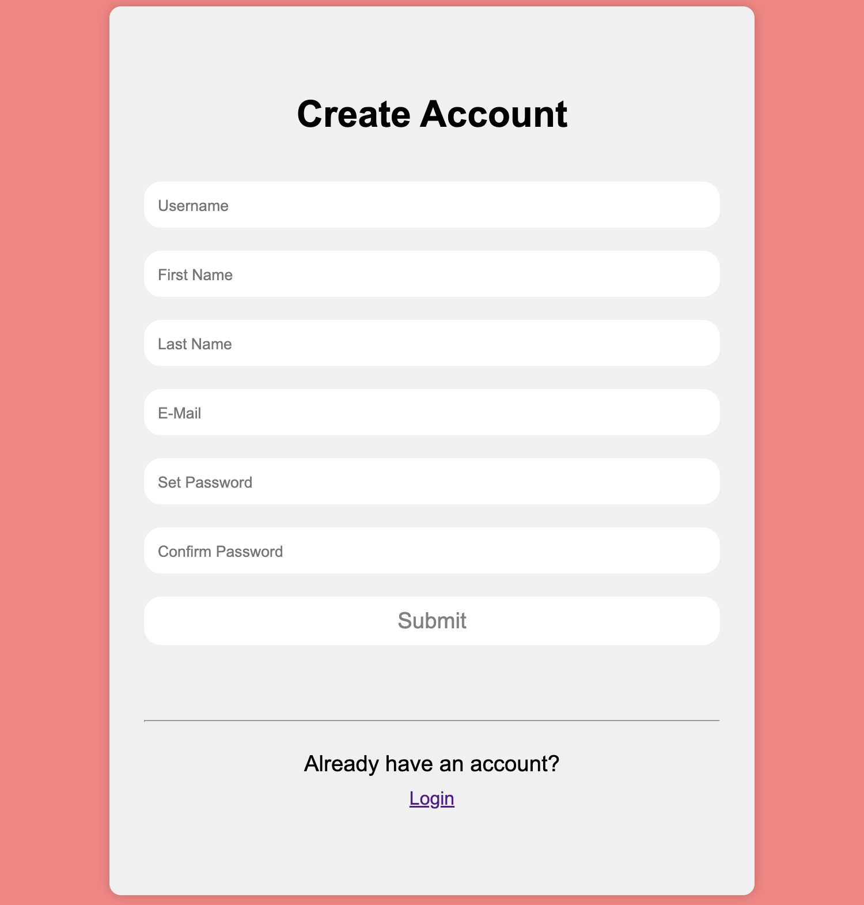
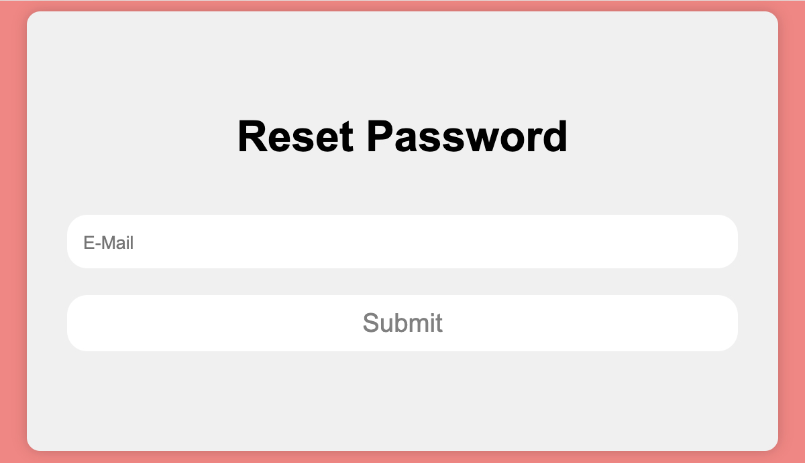
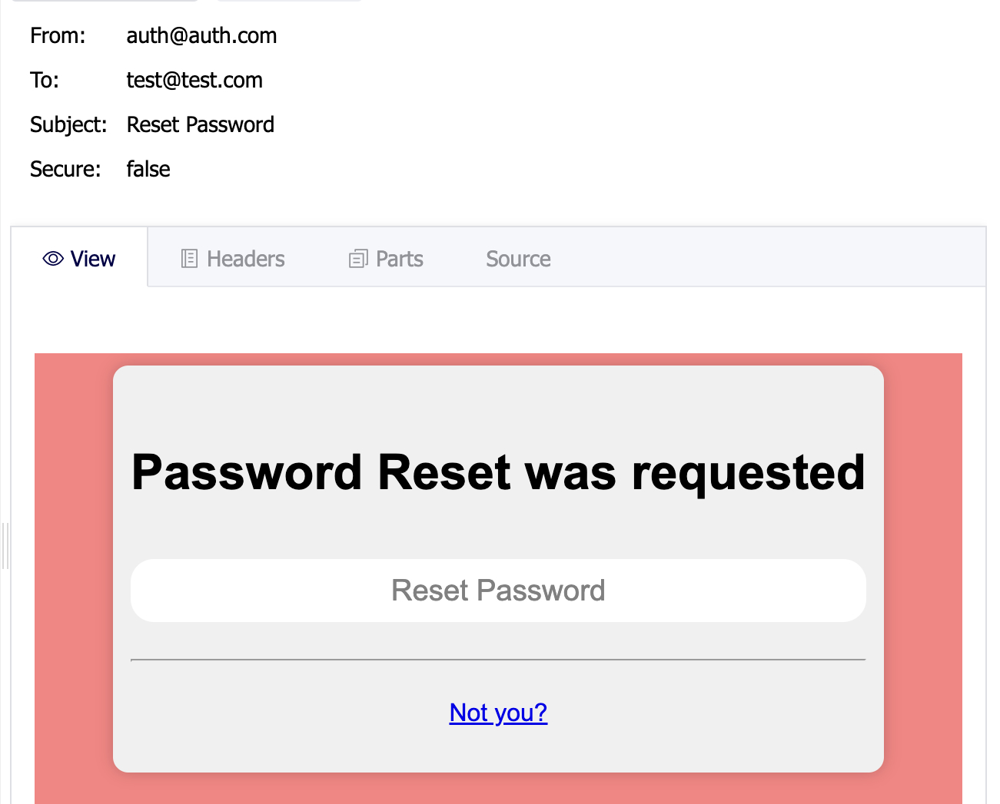
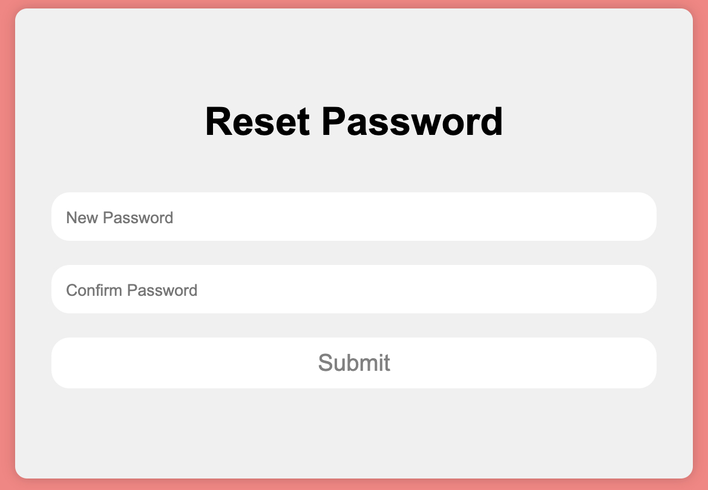
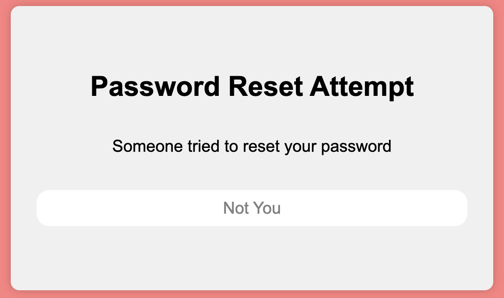

# Custom Django Session Authentication

## Introduction

> The Django application offers a simple yet fully-functional authentication system where users can login, logout,
> create accounts and reset their password.
> It comes with many security features out of the box including a password reset
> that utilizes the user's E-Mail to reset it.
> If the user didn't attempt to reset the password himself he can confirm that it was
> not him resulting in the deletion of a token associated with the process.

> Now if someone tried to reset the password with the link in the E-Mail again, he will receive an HTTP 404 error.


> [!NOTE]
> The E-Mail as well the hints for creating a secure password have to be modified for
each specific use case.

## The User Interface

<div style="
    display: flex;
    flex-direction: column;
    align-items: center;
    text-align: center
">

### Login



<hr>

### Logout



<hr>

### Create Account



<hr>

### Reset Password


<br>

<br>

<br>

</div>

## Installation

Clone the project and install the required dependencies.

```
$ git clone https://github.com/pyracle/Custom-Django-Session-Authentication
```
```
$ pip install -r requirements.txt
```

Add the following apps and settings to your settings.py file.

```python
# settings.py

INSTALLED_APPS = [
    ...,
    "rest_framework",
    "method_override",
    "authentication",
    ...
]

AUTH_USER_MODEL = "authentication.User"

AUTHENTICATION_BACKENDS = [
    "django.contrib.auth.backends.ModelBackend",
    "authentication.backends.EMailBackend"
]
```

Configure the following endpoints in your settings file.

```python
# settings.py

LOGIN_REDIRECT_URL = "/"
LOGOUT_REDIRECT_URL = "/"
ADMIN_URL = "/admin/"
```

The shown E-Mail settings have to be provided. For production usage hide them with environment variables.
<br>
Install [smtp4dev](https://github.com/rnwood/smtp4dev/wiki/Installation) to test the system for development servers.
If set up the E-Mail provider will be available on http://localhost:3000.

```python
# settings.py

EMAIL_HOST = os.getenv("EMAIL_HOST")
EMAIL_HOST_USER = os.getenv("EMAIL_HOST_USER")
EMAIL_HOST_PASSWORD = os.getenv("EMAIL_HOST_PASSWORD")
EMAIL_PORT = os.getenv("EMAIL_PORT")
DEFAULT_FROM_EMAIL = os.getenv("<your-website>@<email>.com")
```

Install [Redis](https://redis.io/docs/install/install-redis/) 
and [Celery](https://docs.celeryq.dev/en/stable/django/first-steps-with-django.html)
and add the following setting.

```python
# settings.py

CELERY_BROKER_URL = os.getenv("CELERY_BROKER_URL")  # usually redis://localhost:6379/1 on development servers
```

Finally, configure the paths for the authentication app.

```python
# urls.py

from django.contrib import admin
from django.conf import settings
from django.urls import path, include
from authentication.views import LoginView


admin_url = settings.ADMIN_URL[1:]

urlpatterns = [
    ...,
    path("auth/", include("authentication.urls")),
    path(f"{admin_url}login/", LoginView.as_view()),
    path(f"{admin_url}", admin.site.urls),
    ...
]
```
